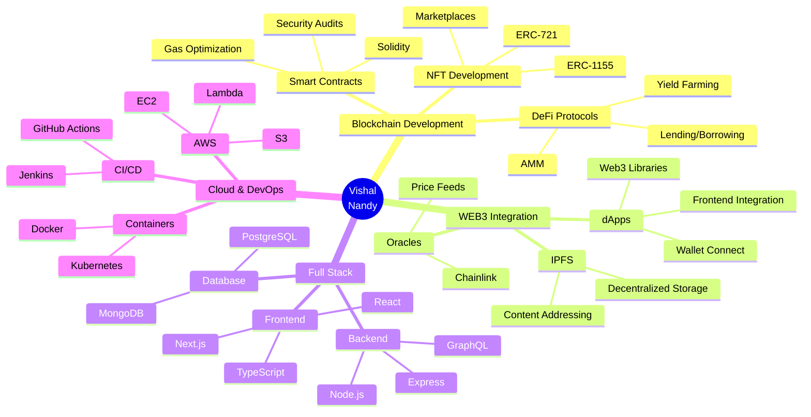

<div align="center">
  
</div>

<div align="center">
  
</div>

<div align="center">
  
  [](https://vishal-phi-drab.vercel.app/)
  [](https://www.linkedin.com/in/vishal-nandy-7a04a427b/)
  [](https://x.com/vishal_nandy20/)
  [](https://instagram.com/__maybe.vishal__/)
  
</div>

<br>

<p align="center">
  
</p>

### 🚀 About Me

```solidity
// SPDX-License-Identifier: MIT
pragma solidity ^0.8.0;

contract VishalNandy {
    string public name = "Vishal Nandy";
    string public title = "Blockchain Engineer";
    string public location = "India 🇮🇳";
    
    string[] public expertise = [
        "Solidity & Smart Contracts",
        "DeFi Protocol Development", 
        "NFT Marketplaces & dApps",
        "Web3 Integration",
        "Full Stack Development",
        "Cloud Architecture"
    ];
    
    string[] public currentlyLearning = [
        "Advanced Smart Contract Security",
        "Zero-Knowledge Proofs",
        "Layer 2 Scaling Solutions",
        "Cross-Chain Protocols"
    ];
    
    mapping(string => bool) public skills;
    
    constructor() {
        skills["Solidity"] = true;
        skills["Web3.js"] = true;
        skills["Ethers.js"] = true;
        skills["Hardhat"] = true;
        skills["React"] = true;
        skills["Next.js"] = true;
        skills["Node.js"] = true;
        skills["AWS"] = true;
    }
    
    function getMotivation() public pure returns (string memory) {
        return "Building the decentralized future, one block at a time ⛓️";
    }
}
```

---

<div align="center">
  
## ⚡ Tech Arsenal


</div>

<br>

<table align="center" width="100%">
<tr>
<td width="50%" valign="top">

### 🔗 Blockchain & WEB3 Ecosystem

```yaml
Smart_Contracts:
  - Solidity ⟠
  - Rust 🦀
  - Go 🔷
  
Blockchain_Networks:
  - Ethereum 💎
  - Polygon 🟣
  - Binance Smart Chain 💛
  - Avalanche 🔺
  - Arbitrum 🔵
  
Development_Tools:
  - Hardhat 👷
  - Truffle 🍫
  - Foundry ⚒️
  - Remix 🎛️
  - Ganache 🥫
  
Web3_Libraries:
  - Web3.js 🌐
  - Ethers.js 📡
  - Wagmi ⚡
  - RainbowKit 🌈
  
Smart_Contract_Standards:
  - ERC-20 (Tokens) 🪙
  - ERC-721 (NFTs) 🎨
  - ERC-1155 (Multi-Token) 🎭
  - ERC-4337 (Account Abstraction) 🔐
  
DeFi_Protocols:
  - Uniswap 🦄
  - Aave 👻
  - Compound 🏦
  - Curve 📈
  
Infrastructure:
  - IPFS 📦
  - The Graph 📊
  - Chainlink 🔗
  - Alchemy 🧪
  - Infura 🌉
```

</td>
<td width="50%" valign="top">

### 💻 Full Stack Development

```yaml
Frontend:
  - React ⚛️
  - Next.js ▲
  - TypeScript 📘
  - Tailwind CSS 🎨
  - Redux 🔄
  - Zustand 🐻
  
Backend:
  - Node.js 💚
  - Express.js 🚂
  - NestJS 🦅
  - GraphQL 📈
  - REST APIs 🔌
  
Databases:
  - MongoDB 🍃
  - PostgreSQL 🐘
  - Redis ⚡
  - MySQL 🐬
  - Prisma ORM 🔷
  
Authentication:
  - JWT 🎫
  - OAuth 2.0 🔐
  - Web3Auth 🌐
  - Magic Link ✨
```

### ☁️ Cloud & DevOps

```yaml
Cloud_Platforms:
  - AWS ☁️
  - Google Cloud Platform 🌥️
  - Azure ⛅
  - Vercel 🔺
  
Containerization:
  - Docker 🐳
  - Kubernetes ⚓
  
CI/CD:
  - GitHub Actions 🤖
  - Jenkins 🔧
  - GitLab CI 🦊
  
Monitoring:
  - Prometheus 📊
  - Grafana 📈
```

</td>
</tr>
</table>

<br>

<div align="center">

### 🎯 Core Blockchain Technologies


<br><br>


<br>


### 🛠️ Development Stack


</div>

---

<div align="center">

## 📊 GitHub Statistics


<br><br>


</div>

---

<div align="center">

## 🏆 GitHub Trophies


</div>

---

<div align="center">

## 📈 Contribution Snake 🐍

<picture>
  <source media="(prefers-color-scheme: dark)" srcset="https://raw.githubusercontent.com/VishalNandy17/VishalNandy17/output/github-contribution-grid-snake-dark.svg">
  <source media="(prefers-color-scheme: light)" srcset="https://raw.githubusercontent.com/VishalNandy17/VishalNandy17/output/github-contribution-grid-snake.svg">
  
</picture>

_🔄 The snake animation will appear here once the GitHub Action workflow runs successfully!_

</div>

---

<div align="center">

## 💡 Random Dev Quote


</div>

---

<div align="center">

## 🎯 WEB3 Development Focus

</div>



---

<div align="center">

## 🔥 Recent Activity

<!--START_SECTION:activity-->
<!-- This section will be automatically updated by GitHub Activity -->
<!--END_SECTION:activity-->

</div>

---

<div align="center">

## 📌 Featured Projects

</div>

<div align="center">

[](https://github.com/VishalNandy17/defi-protocol)
[](https://github.com/VishalNandy17/nft-marketplace)

</div>

---

<div align="center">

## 📫 Let's Connect & Build the Decentralized Future!

<p align="center">
  
</p>

[](https://vishal-phi-drab.vercel.app/)
[](https://www.linkedin.com/in/vishal-nandy-7a04a427b/)
[](https://x.com/vishal_nandy20/)
[](https://instagram.com/__maybe.vishal__/)
[](mailto:vishalnandy@example.com)

<br>


<br><br>

### ⭐ From [VishalNandy17](https://github.com/VishalNandy17) with 💙

*"In blockchain we trust, in code we build the future"* ⛓️

</div>


