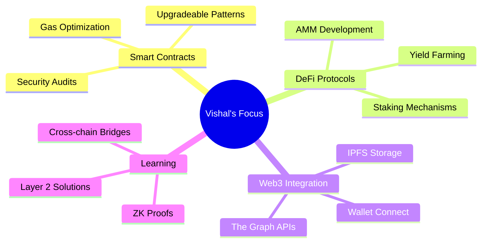

<div align="center">

<!-- Animated Header with Gradient -->


<!-- Typing Animation -->
<a href="https://git.io/typing-svg">
  
</a>

<br/>

<!-- Animated Divider -->


</div>

## 🚀 About Me


```typescript
const vishal = {
    location: "Building in Web3 🌐",
    role: "Blockchain Protocol Engineer",
    code: ["Solidity", "Rust", "JavaScript", "TypeScript", "Python"],
    focus: ["Smart Contracts", "DeFi", "DAOs", "NFTs"],
    technologies: {
        blockchain: ["Ethereum", "Polygon", "Solana", "Hyperledger"],
        frameworks: ["Hardhat", "Foundry", "Truffle", "Anchor"],
        tools: ["IPFS", "The Graph", "Chainlink", "OpenZeppelin"],
        frontend: ["React", "Next.js", "Web3.js", "Ethers.js"]
    },
    currentlyLearning: "Zero-Knowledge Proofs & Layer 2 Solutions",
    funFact: "I debug smart contracts in my sleep 😴"
};
```

<br clear="right"/>

<!-- Animated Divider -->


## 🛠️ Tech Stack & Tools

<div align="center">

### Blockchain & Web3
<p>
  
  
  
  
  
  
</p>

### Languages & Frameworks
<p>
  
  
  
  
  
  
</p>

### Tools & Platforms
<p>
  
  
  
  
  
</p>

</div>

<!-- Animated Divider -->


## 📊 GitHub Analytics

<div align="center">
  
  
</div>

<div align="center">
  
  
</div>

<!-- Trophy Section -->
<div align="center">
  
</div>

<!-- Animated Divider -->


## 🎯 Current Focus

<div align="center">



</div>

<!-- Animated Divider -->


## 🌐 Connect With Me

<div align="center">

<a href="https://linkedin.com/in/vishal-nandy-7a04a427b" target="_blank">
  
</a>
<a href="https://vishal-phi-drab.vercel.app/" target="_blank">
  
</a>
<a href="https://twitter.com/vishalnandy17" target="_blank">
  
</a>
<a href="mailto:your.email@example.com" target="_blank">
  
</a>

<br/><br/>

### 💚 Support My Work

<a href="https://ko-fi.com/vishalnandy" target="_blank">
  
</a>
<a href="https://www.buymeacoffee.com/vishalnandy" target="_blank">
  
</a>

</div>

<!-- Animated Divider -->


## 📈 Contribution Activity

<div align="center">
  
[](https://github.com/VishalNandy17)

</div>

<!-- Snake Animation -->
<div align="center">
  
</div>

<!-- Animated Divider -->


## 💭 Random Dev Quote

<div align="center">


</div>

<!-- Visitor Counter -->
<div align="center">
  
</div>

<br/>

<!-- Footer Wave -->


---

<div align="center">
  
  <b>Made with ❤️ by Vishal Nandy</b>
  
</div>
