<div align="center">

<!-- 3D Animated Header -->


<!-- Holographic Title with 3D Effect -->
<h1>
  
</h1>


<br/><br/>

<!-- 3D Contribution Calendar -->


<!-- If above doesn't work, use this alternative -->
<a href="https://github.com/VishalNandy17">
  
  
</a>

<br/>

<!-- Isometric Contribution Graph (3D Style) -->


<br/><br/>

<!-- 3D GitHub Skyline (requires separate generation but shown as placeholder) -->
<a href="https://skyline.github.com/VishalNandy17/2024">
  
</a>

</div>

---

## 🎮 INTERACTIVE PROFILE DASHBOARD

<div align="center">

```ascii
╔══════════════════════════════════════════════════════════════════╗
║                    BLOCKCHAIN PROTOCOL ENGINEER                   ║
║                           STATUS: ACTIVE                          ║
╠══════════════════════════════════════════════════════════════════╣
║  🎯 FOCUS AREAS                                                   ║
║  ├─ Smart Contract Architecture & Security                        ║
║  ├─ DeFi Protocol Development                                     ║
║  ├─ Zero-Knowledge Proof Systems                                  ║
║  └─ Cross-Chain Bridge Engineering                                ║
╠══════════════════════════════════════════════════════════════════╣
║  ⚡ CURRENT STACK                                                 ║
║  ├─ Solidity | Rust | Move                                        ║
║  ├─ Hardhat | Foundry | Anchor                                    ║
║  ├─ React | Next.js | TypeScript                                  ║
║  └─ Ethers.js | Web3.js | viem                                    ║
╠══════════════════════════════════════════════════════════════════╣
║  📊 STATS OVERVIEW                                                ║
║  ├─ Total Commits (2024): 1,337+                                  ║
║  ├─ Smart Contracts Deployed: 50+                                 ║
║  ├─ Active Projects: 12                                           ║
║  └─ Coffee Consumed: ∞                                            ║
╚══════════════════════════════════════════════════════════════════╝
```

</div>

---

## 🛸 3D TECH STACK GALAXY

<div align="center">

<table>
<tr>
<td width="50%" valign="top">

### ⛓️ BLOCKCHAIN LAYER
```javascript
const blockchain = {
  platforms: [
    "🔷 Ethereum",
    "🟣 Polygon", 
    "🔵 Solana",
    "🟢 Avalanche",
    "🔴 Arbitrum"
  ],
  languages: [
    "📜 Solidity",
    "🦀 Rust", 
    "⚡ Move",
    "🔧 Vyper"
  ],
  frameworks: [
    "⚒️ Hardhat",
    "🔨 Foundry",
    "🏗️ Truffle",
    "⚓ Anchor"
  ]
};
```

</td>
<td width="50%" valign="top">

### 🌐 WEB3 INTEGRATION
```typescript
const web3Stack = {
  libraries: [
    "📚 Ethers.js",
    "🕸️ Web3.js",
    "⚡ viem",
    "🔗 Wagmi"
  ],
  storage: [
    "🗂️ IPFS",
    "💾 Arweave",
    "📦 Filecoin"
  ],
  oracles: [
    "🔗 Chainlink",
    "📊 Band Protocol",
    "🌐 API3"
  ]
};
```

</td>
</tr>
<tr>
<td width="50%" valign="top">

### 💻 DEVELOPMENT TOOLS
```python
tools = {
    "editors": ["VS Code", "Remix"],
    "testing": ["Mocha", "Chai", "Waffle"],
    "security": ["Slither", "Mythril", "Echidna"],
    "deployment": ["Docker", "Kubernetes"],
    "monitoring": ["Tenderly", "The Graph"]
}
```

</td>
<td width="50%" valign="top">

### 🎨 FRONTEND STACK
```jsx
const frontend = {
  frameworks: ["React ⚛️", "Next.js 🚀"],
  styling: ["TailwindCSS 🎨", "Framer Motion ✨"],
  state: ["Redux 📦", "Zustand 🐻"],
  web3UI: ["RainbowKit 🌈", "ConnectKit 🔌"],
  data: ["Apollo Client 🚀", "React Query ⚡"]
};
```

</td>
</tr>
</table>

</div>

---

## 📊 3D ANALYTICS DASHBOARD

<div align="center">

<!-- Trophy Cabinet in 3D Style -->


<br/>

<!-- Detailed Statistics Grid -->


<br/>

<!-- Advanced Contribution Graph -->


<br/>

<!-- Streak Stats with 3D Effect -->


</div>

---

## 🎯 CURRENT MISSION OBJECTIVES

```mermaid
%%{init: {'theme':'base', 'themeVariables': { 'primaryColor':'#0D1117','primaryTextColor':'#00FFA3','primaryBorderColor':'#00D9FF','lineColor':'#00FFA3','secondaryColor':'#1a1b27','tertiaryColor':'#0D1117'}}}%%
graph TB
    A[🚀 VISHAL'S WEB3 JOURNEY] --> B[Smart Contracts]
    A --> C[DeFi Protocols]
    A --> D[Security Audits]
    A --> E[Innovation]
    
    B --> B1[Gas Optimization]
    B --> B2[Upgradeable Patterns]
    B --> B3[ERC Standards]
    
    C --> C1[AMM Development]
    C --> C2[Yield Aggregators]
    C --> C3[Liquidity Mining]
    
    D --> D1[Vulnerability Testing]
    D --> D2[Formal Verification]
    D --> D3[Best Practices]
    
    E --> E1[ZK Proofs]
    E --> E2[Layer 2 Solutions]
    E --> E3[Cross-chain Bridges]
    
    style A fill:#00FFA3,stroke:#00D9FF,stroke-width:4px,color:#000
    style B fill:#1a1b27,stroke:#00FFA3,stroke-width:2px,color:#00FFA3
    style C fill:#1a1b27,stroke:#00FFA3,stroke-width:2px,color:#00FFA3
    style D fill:#1a1b27,stroke:#00FFA3,stroke-width:2px,color:#00FFA3
    style E fill:#1a1b27,stroke:#00FFA3,stroke-width:2px,color:#00FFA3
```

<div align="center">



</div>

---

## 🌐 NETWORK CONNECTIONS

<div align="center">

<table>
<tr>
<td align="center" width="25%">
<a href="https://linkedin.com/in/vishal-nandy-7a04a427b">

</a>
<br/>
<sub><b>Professional Network</b></sub>
</td>
<td align="center" width="25%">
<a href="https://vishal-phi-drab.vercel.app/">

</a>
<br/>
<sub><b>Projects Showcase</b></sub>
</td>
<td align="center" width="25%">
<a href="https://twitter.com/vishalnandy17">

</a>
<br/>
<sub><b>Tech Updates</b></sub>
</td>
<td align="center" width="25%">
<a href="mailto:your.email@example.com">

</a>
<br/>
<sub><b>Direct Contact</b></sub>
</td>
</tr>
</table>

<br/>

### 💎 SUPPORT THE MISSION

<a href="https://ko-fi.com/vishalnandy">
  
</a>
&nbsp;&nbsp;
<a href="https://www.buymeacoffee.com/vishalnandy">
  
</a>

</div>

---

## 🏆 ACHIEVEMENTS & BADGES

<div align="center">

<!-- Holopin Badges (3D Style) -->
<a href="https://holopin.io/@vishalnandy17">
  
</a>

<br/><br/>

<!-- Skill Badges in 3D Grid -->


</div>

---

## 🎨 3D CONTRIBUTION HEATMAP

<div align="center">

<!-- Enhanced Contribution Calendar -->


</div>

---

## 📈 REAL-TIME METRICS

<div align="center">

<!-- WakaTime Stats (requires setup) -->


<br/><br/>

<!-- Profile Views Counter with 3D Effect -->


</div>

---

## 💭 DEVELOPER WISDOM

<div align="center">


</div>

---

<div align="center">

### 🔮 BUILD • INNOVATE • DECENTRALIZE


<br/>

**⭐ Star my repositories if you find them interesting!**


</div>
