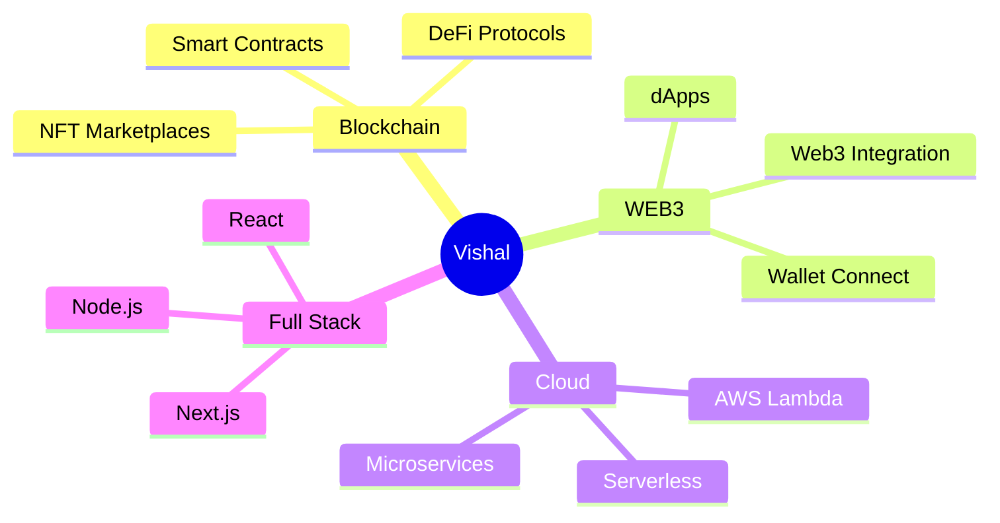

<div align="center">
  
</div>

<div align="center">
  
</div>

<div align="center">
  
  [](https://vishal-phi-drab.vercel.app/)
  [](https://www.linkedin.com/in/vishal-nandy-7a04a427b/)
  [](https://x.com/vishal_nandy20/)
  [](https://instagram.com/__maybe.vishal__/)
  
</div>

<br>


### 🚀 About Me

```javascript
const vishal = {
    title: "Blockchain Engineer",
    location: "India 🇮🇳",
    focus: ["WEB3", "Blockchain", "Full Stack", "Cloud"],
    currentlyLearning: "Advanced Smart Contract Security",
    funFact: "I debug smart contracts in my sleep 😴",
    askMeAbout: ["Solidity", "DeFi", "Web3", "Cloud Architecture"],
    reachOut: "vishal.nandy@example.com"
};
```

<br clear="right"/>

---

<div align="center">
  
### ⚡ Tech Arsenal

</div>

#### 🔗 Blockchain & WEB3
<p align="center">
  
  <br>
  
  
  
  
  
</p>

#### 💻 Full Stack Development
<p align="center">
  
  <br>
  
</p>

#### ☁️ Cloud & DevOps
<p align="center">
  
  <br>
  
</p>

#### 🛠️ Tools & Others
<p align="center">
  
</p>

---

<div align="center">

### 📊 GitHub Statistics


</div>

---

<div align="center">

### 🏆 GitHub Trophies


</div>

---

<div align="center">

### 📈 Contribution Snake

<picture>
  <source media="(prefers-color-scheme: dark)" srcset="https://raw.githubusercontent.com/VishalNandy17/VishalNandy17/output/github-contribution-grid-snake-dark.svg">
  <source media="(prefers-color-scheme: light)" srcset="https://raw.githubusercontent.com/VishalNandy17/VishalNandy17/output/github-contribution-grid-snake.svg">
  
</picture>

</div>

---

<div align="center">

### 💡 Random Dev Quote


</div>

---

<div align="center">

### 🎯 Current Focus



</div>

---

<div align="center">

### 📫 Let's Connect & Build the Decentralized Future!

[](https://vishal-phi-drab.vercel.app/)
[](https://www.linkedin.com/in/vishal-nandy-7a04a427b/)
[](https://x.com/vishal_nandy20/)
[](https://instagram.com/__maybe.vishal__/)

<br>


<br><br>

### ⭐ From [VishalNandy17](https://github.com/VishalNandy17) with 💙

</div>


